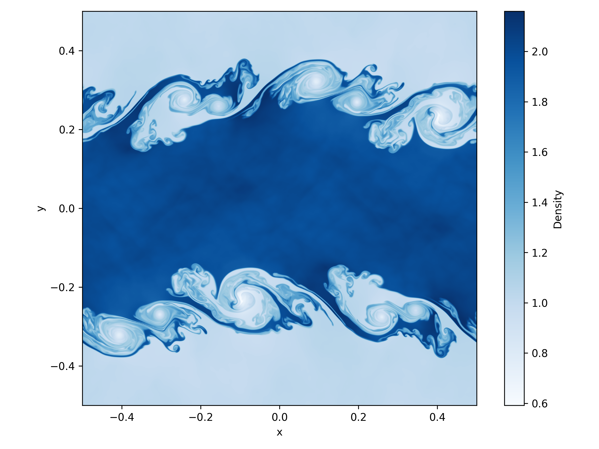
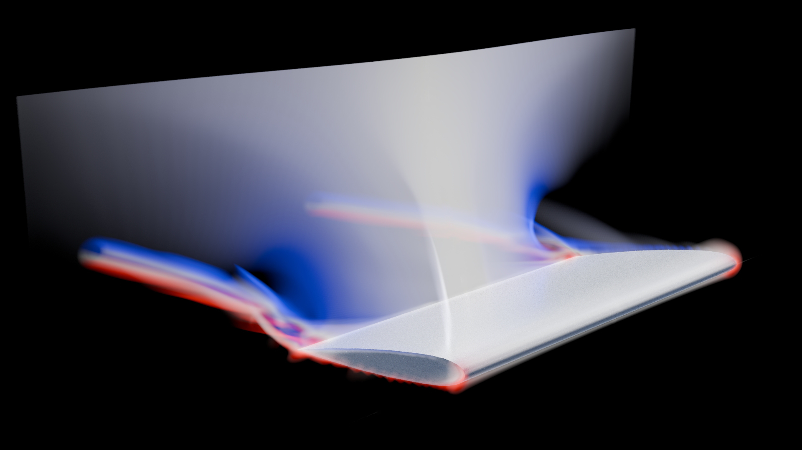

# Simple CFD

This is a lightweight computational fluid dynamics code that solves the compressible Euler equations in 1D, 2D, or 3D using a conservative finite volume method on a Cartesian mesh. In order to achieve second-order accuracy in space and time, it uses MUSCL-Hancock reconstruction, and numerical fluxes are calculated using the HLLC approximate Riemann solver in a dimensionally split manner. Currently, only the ideal gas equation of state is implemented, but this can easily be extended. Boundaries can be transmissive, reflective, or periodic and parallelism is supported via OpenMP.

## Compilation settings

There are five important settings for the code, all found in Macros.H. Firstly, USE_OMP determines whether the code is compiled with OpenMP support. Secondly, REAL determines which level of precision the code uses for floating point numbers (double by default, unlikely to change). GRIDDIM and SPACEDIM specify the number of spatial dimensions of the problem. Here, GRIDDIM is the dimensionality of the domain, while SPACEDIM is the dimensionality of the velocity vector. In general, they should be set to the same value, although SPACEDIM > GRIDDIM is also allowed. Finally, USE_RIGID determines whether the code is compiled with support for rigid bodies. After changing any of these settings, it may be necessary to remove the object files (*.o) and re-compile for them to take effect.

An additional setting is available in Macros.H - the DEBUG setting. Activating it will perform various checks as the program runs, allowing the user to more quickly find the source of errors. However, it slows the program down, so it is turned off by default.

## Running tests

Once the settings in Macros.H have been set, the relevant test case for the chosen dimensionality can be run and plotted using runTests.bash. Here, the desired number of OpenMP threads can also be set. Note that two files are created to store the results from each run: one .txt file and one .dat file. The .txt (header) file contains metadata in human-readable format (number of steps taken, final time, domain extents, resolution, number of variables), as well as the name of the second file: a .dat (data) file that contains the state of the simulation in binary format.

## Settings files

If we have such a pair of files at our disposal, the simulation can be started from this data. For this, we need to create a settings file with the following lines:

initial-file-name  
final-file-name  
final-time  
low-boundary-conditions  
high-boundary-conditions  
[gamma]  
[signed-distance-function-file-name]

Here, initial-file-name is the name of the header file from which the simulation starts (without file extension, assuming .txt), final-file-name is the name of the header file to which the simulation result will be written (without file extension, assuming .txt), final-time is the time until which the simulation will run. low-boundary-conditions and high-boundary-conditions are the boundary conditions on the low and high sides of the domain, each encoded by GRIDDIM integers (0 for transmissive, 1 for reflective, and 2 for periodic) separated by whitespaces. gamma is an optional argument specifying the adiabatic index to be used in the ideal gas equation of state (1.4 by default). signed-distance-function-file-name is another optional argument, which will be used to define the rigid body in the problem, if provided (and compiled with USE_RIGID). Here, the boundary of the rigid body is taken to be the zero contour of the signed distance function, and negative values correspond to the inside of the rigid body. It is worth noting that the signed distance function has to be provided for one cell outside the valid domain. For three-dimensional simulations, the signed distance function can also be computed from an STL file. To make use of this feature, signed-distance-function-file-name should be the name of the STL file (without file extension, assuming .stl).

Once a settings file is created, the simulation can be run as ./simple-cfd settings-file-name, where settings-file-name is the name of the file (without file extension, assuming .txt). These settings files, the intial data, and the signed distance functions can of course be generated by a script. shock_reflection.py provides an example of such a script, which sets up, runs, and plots the shock reflection problem.

## Importing simulation data into Blender

For more elaborate 3D visualisations, simulation outputs can also be imported into Blender using the simple-cfd-importer.py script. In order to make use of this functionality, install the script as a Blender add-on (required Blender version 4.4 or later). A new panel will then become visible in the side bar of the 3D viewport (press N to show it) which allows the user to select a header file and import the associated data as a volume object. The result is stored as an OpenVDB file.

## Example results

The results of two example simulations can be seen in **Figure 1** and **Figure 2**.

*Figure 1: Visualization of the Kelvin–Helmholtz instability demonstrating fluid shear between two layers.*

*Figure 2: Volumetic render of supersonic flow over a wing showing wingtip vortices and a shock wave on the suction side.*

## Future work

A possible improvement to the code would be averaging procedures to more accurately prescribe initial conditions. The lack of these methods leads to start-up errors, which can, for example, be observed in the cylindrical and spherical explosions in the parts of the contact discontinuity that are perpendicular to the axes.
