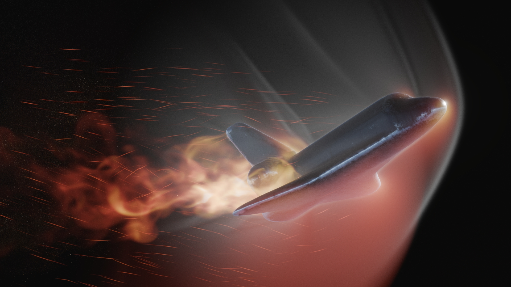
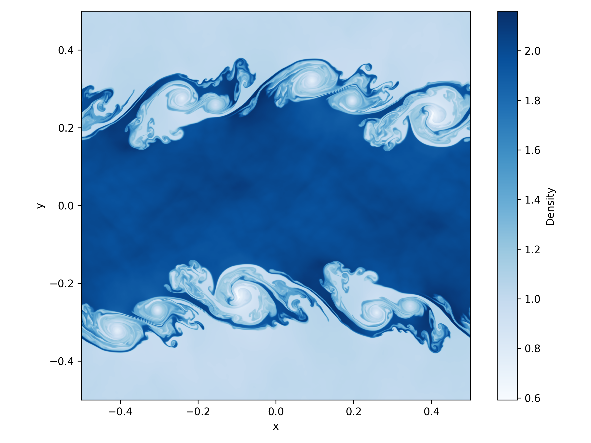
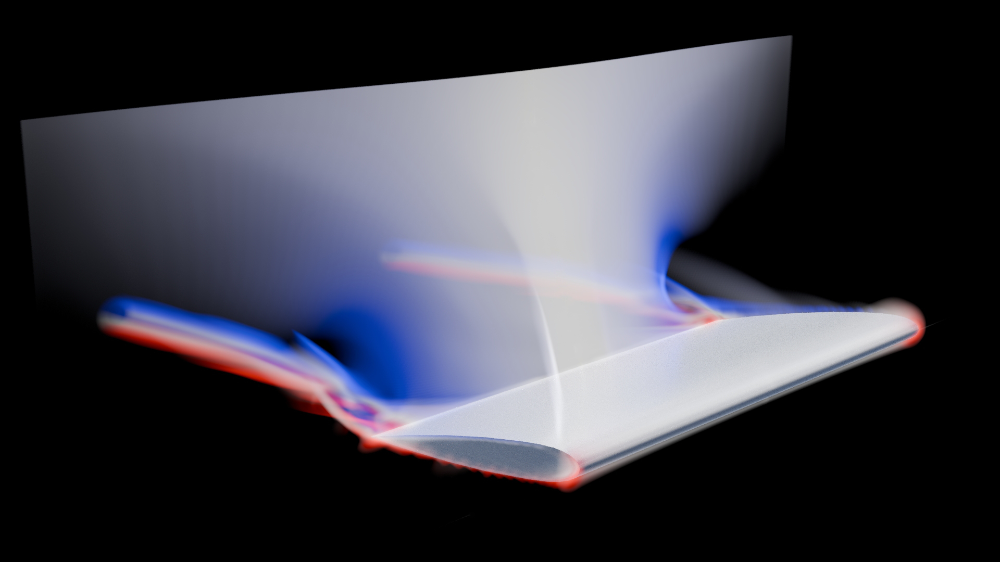

# Ilmatar CFD

Ilmatar CFD is a lightweight computational fluid dynamics code that solves the compressible Euler equations in 1D, 2D, or 3D using a conservative finite volume method on a Cartesian mesh. In order to achieve second-order accuracy in space and time, it uses MUSCL-Hancock reconstruction, and numerical fluxes are calculated using the HLLC approximate Riemann solver in a dimensionally split manner. Currently, only the ideal gas equation of state is implemented, but other equations of state can easily be added. Boundaries can be transmissive, reflective, or periodic and parallelism is supported via OpenMP.


*Figure 1: Volumetic rendering of supersonic flow over a Space Shuttle showing shock waves and a turbulent wake.*

## Background
A simplification of the famous Navier-Stokes equations, the compressible Euler equations are a system of hyperbolic partial differential equations that describe the conservation of mass, momentum and total energy for inviscid fluids without thermal conduction:

$$\frac{\partial \rho}{\partial t} + \nabla \cdot (\rho \mathbf{v}) = 0 ,$$

$$\frac{\partial (\rho \mathbf{v})}{\partial t} + \nabla \cdot (\rho \mathbf{v} \otimes \mathbf{v} + I p) = 0 ,$$

$$\frac{\partial E}{\partial t} + \nabla \cdot ((E + p) \mathbf{v}) = 0 ,$$

where $\rho$ is density, $\mathbf{v}$ is velocity, $p$ is pressure, and $E = \rho e + \frac{1}{2} \rho \mathbf{v} \cdot \mathbf{v}$ is the total energy composed of an internal and a kinetic component. In order to close the system, an equation of state (EoS) is needed. In this code, the ideal gas EoS is used:

$$p = (\gamma - 1) \rho e ,$$

where $\gamma$ is the adiabatic index of the gas, which is $1.4$ for air at atmospheric conditions. Other equations of state can easily be implemented in the code in order to model fluids with more complex thermodynamics.

The equations are solved using a conservative finite volume scheme, where the domain is divided into a grid of cells. Within each cell, the change of mass, momentum, and total energy is computed over a series of small, successive time steps until the final time of the simulation has been reached. The size of these time steps is automatically determined by the code based on a stability criterion called the CFL condition. Within each time step, the flux of mass, momentum, and total energy across each cell face is calculated, and used to update the state in the cells.

## Compilation settings

There are four settings for the code in `Macros.H`. `REAL` determines which level of precision the code uses for floating point numbers (double by default, unlikely to change). `GRIDDIM` and `SPACEDIM` specify the number of spatial dimensions of the problem. to be simulated. Here, `GRIDDIM` is the dimensionality of the domain, while `SPACEDIM` is the dimensionality of the velocity vector. In general, they should be set to the same value, although `SPACEDIM` > `GRIDDIM` is also allowed. Finally, `USE_RIGID` determines whether the code is compiled with support for rigid bodies. Before running any simulation, ensure that the code has been compiled with the correct settings. After any change, remove the executable (`ilmatar-cfd`) and object files (`.o`) and re-compile. This can be done by running `make clean` and `make` in succession.

Further compilation settings are available in `Makefile`. The `DEBUG` setting performs various checks as the program runs, allowing the user to more quickly find the source of errors. However, it slows the program down, so it is turned off by default. The `USE_VDB` setting enables compilation with OpenVDB support which allows for easy visualisation of three-dimensional simulation results in graphics software such as Blender. OpenVDB has to be installed separately for this to work. Finally, the `USE_OMP` setting enables compilation with OpenMP support, which speeds up simulations through parallel processing.

## Running tests

Once the settings in `Macros.H` and the `Makefile` have been set, the relevant test cases for the chosen dimensionality can be run and plotted using `run_tests.bash`. Here, the desired number of OpenMP threads can also be set. Note that two files are created to store the results from each run: one `.txt` file and one `.dat` file. The `.txt` (header) file contains metadata in human-readable format (number of steps taken, final time, domain extents, resolution, number of variables), as well as the name of the second file: a `.dat` (data) file that contains the state of the simulation in binary format. Some tests produce two header and data file pairs: one for the actual simulation data, and one for the signed distance function (SDF) describing the rigid body present in the problem. Here, the boundary of the rigid body is taken to be the zero contour of the SDF, and negative values correspond to the inside of the rigid body. It is worth noting that the SDF is provided for one cell outside the valid domain.

## Settings files

If a pair of header and data files is available, it can be used to start a new simulation. For this, a settings file needs to be created in the same directory in the following format:

```
init_header_fname = init_header.txt
final_time = 1.0
bc_lo = 0 0 0
bc_hi = 0 0 0
gamma = 1.4
cfl = 0.9
sdf_header_fname = sdf_header.txt
out_header_base_fname = out_header_base.txt
out_interval = 0.0
vdb_base_fname = vdb_base.txt
vdb_interval = 0.0
vdb_start_idx = 0
```

Here, `init_header_fname` and `final_time` are the only required fields, which specify the name of the header file from which the simulation starts and the time until which the simulation is run. `bc_lo` and `bc_hi` contain the boundary conditions on the low and high sides of the domain, each encoded by `GRIDDIM` integers (0 for transmissive, 1 for reflective, and 2 for periodic) separated by whitespaces. If not specified, they are assumed to be transmissive. `gamma` is the adiabatic index to be used in the ideal gas (1.4 if not specified) and `cfl` is the CFL number which is the fraction of the actual time step size chosen over the maximum allowable time step size (0.9 if not specified).

`sdf_header_fname`, if provided, refers to the header file describing the rigid body in the problem. It only takes effect if the code has been compiled with `USE_RIGID`. For three-dimensional simulations, the SDF can also be computed from an STL file. To make use of this feature, `sdf_header_fname` should simply refer to the STL file. Note that if a valid header and data file pair with the same name as the STL file is available, it is prioritised.

If the output files should have a different base name than the initial file, it can be provided via `out_header_base_fname`. `out_interval` gives the time interval in which the state of the simulation is saved. By default, it is only saved once the simulation is complete.

Finally, if the code is compiled with `USE_VDB`, a base name for the VDB files can be given as `vdb_base_fname`, the time interval in which VDB files are saved can be specified through `vdb_interval` and `vdb_start_idx` gives the integer index appended to the first VDB file (0 if not specified).

Once a settings file is created, the simulation can be run as `./ilmatar-cfd settings-file-name`, where `settings-file-name` is the name of the file. These settings files, the intial data, and the signed distance functions can be generated by a script. `shock_reflection.py` provides an example of such a script, which sets up, runs, and plots the shock reflection problem. `kelvin_helmholtz.py` is another example of setting up, running and post-processing a simulation in a single script - this time, creating a movie from it.

## Importing simulation data into Blender

For more elaborate visualisations, 3D simulation outputs can also be imported into Blender as VDB files. If the code has been compiled with `USE_VDB`, the VDB files can be created directly as simulation outputs. An alternative is provided by the `ilmatar_cfd_importer.py` script. It can be installed as a Blender add-on (requires Blender version 4.4 or later). A new panel then becomes visible in the side bar of the 3D viewport (press `N` to show it) which allows the user to select a header file and import the associated data as a volume object. The result is stored as an OpenVDB file. If a time series of header files is available from a simulation, the user can also create a series file, which is a text file containing a list of header files:

```
header-name-1
header-name-2
header-name-3
...
```

Importing this series file converts all members of the series to OpenVDB files and imports them such that that each corresponds to one frame on the Blender time line (in the order in which they were listed). Note that large time series of 3D simulations can take up a lot of storage space, so ensure that you have enough available.

## Example results

The results of example simulations can be seen in **Figure 1**, **Figure 2** and **Figure 3**.


*Figure 2: Visualization of the Kelvin–Helmholtz instability demonstrating fluid shear between two layers.*


*Figure 3: Volumetic rendering of supersonic flow over a wing showing wingtip vortices and a shock wave on the suction side.*

## Future work

A possible improvement to the code would be averaging procedures to more accurately prescribe initial conditions for the test problems. The lack of these methods leads to start-up errors, which can, for example, be observed in the cylindrical and spherical explosions in the parts of the contact discontinuity that are perpendicular to the axes.

Furthermore, the algorithm for computing a signed distance function from an STL file is wholly unoptimised and could be improved in order to start simulations with complex shapes and high resolution more quickly.
